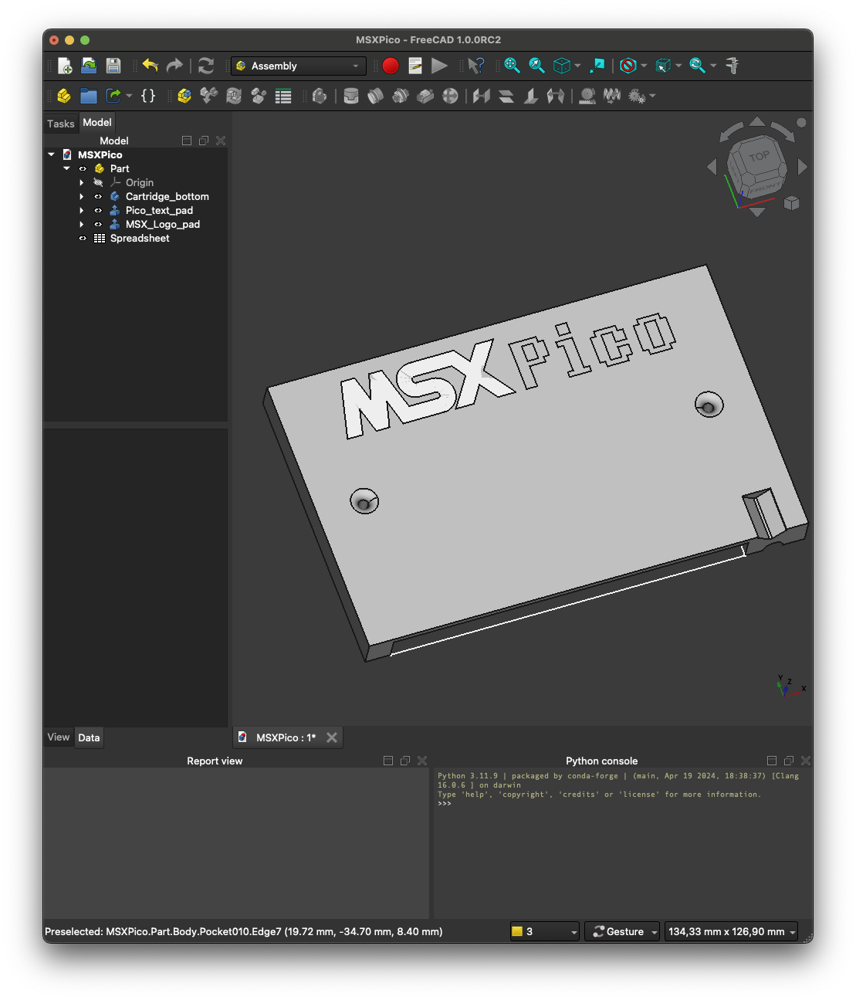
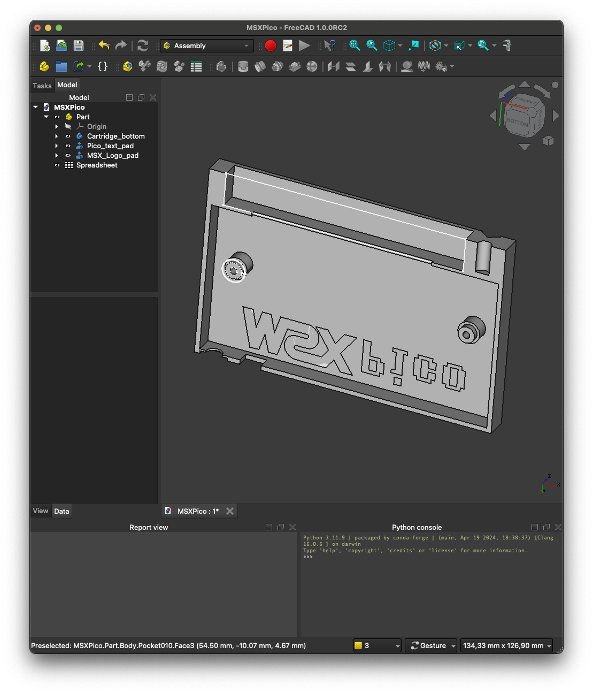
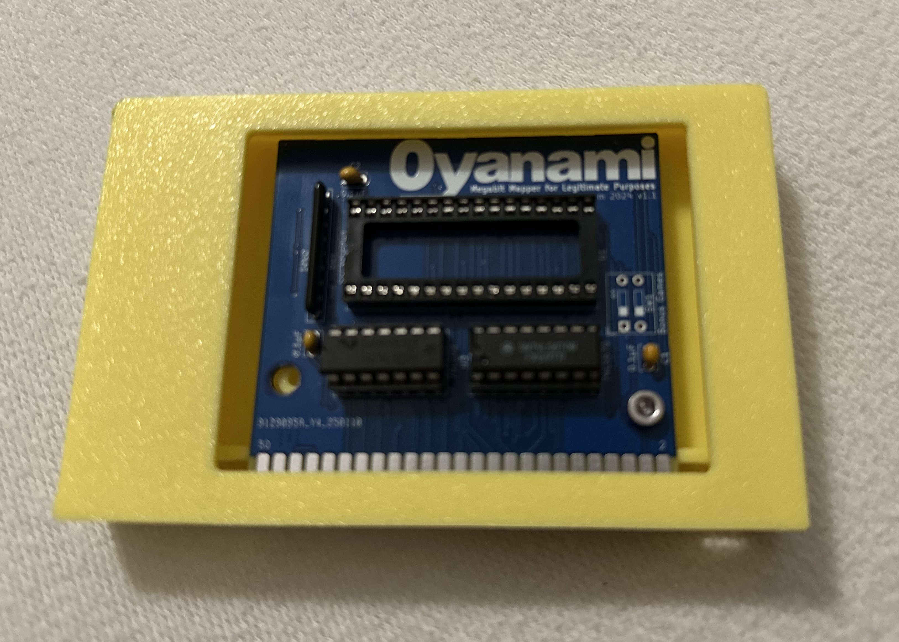
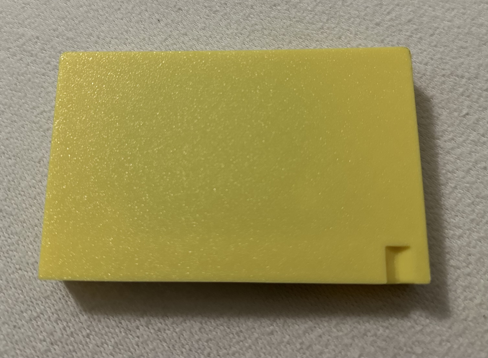
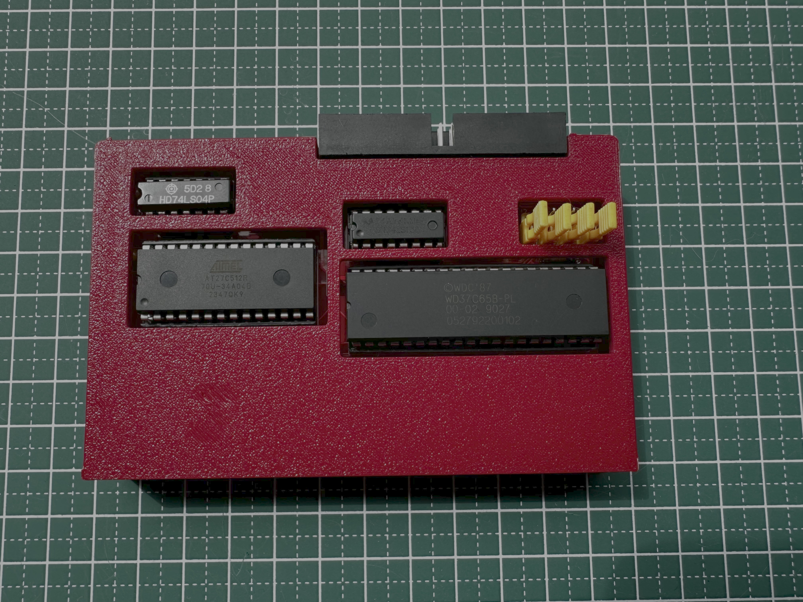
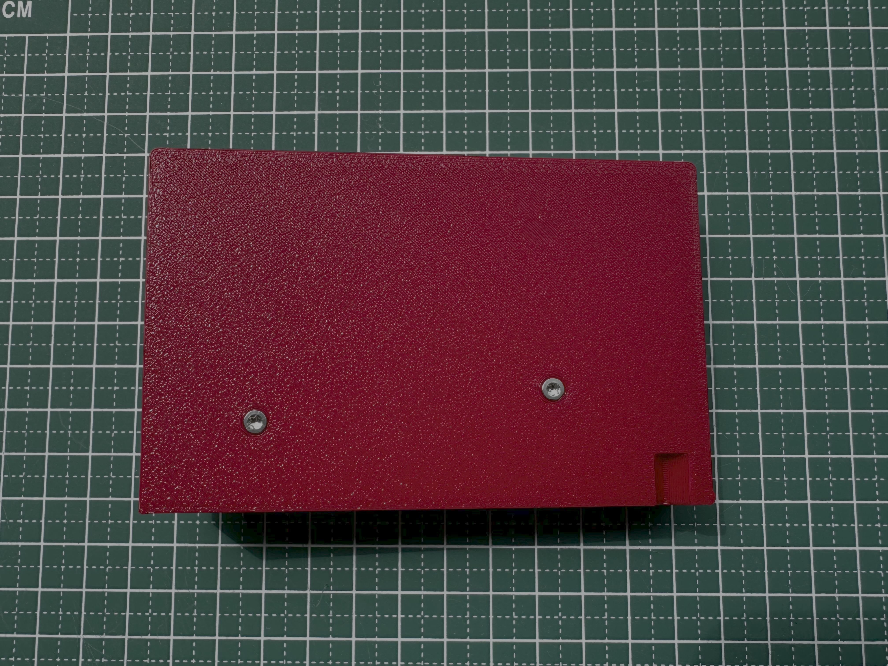
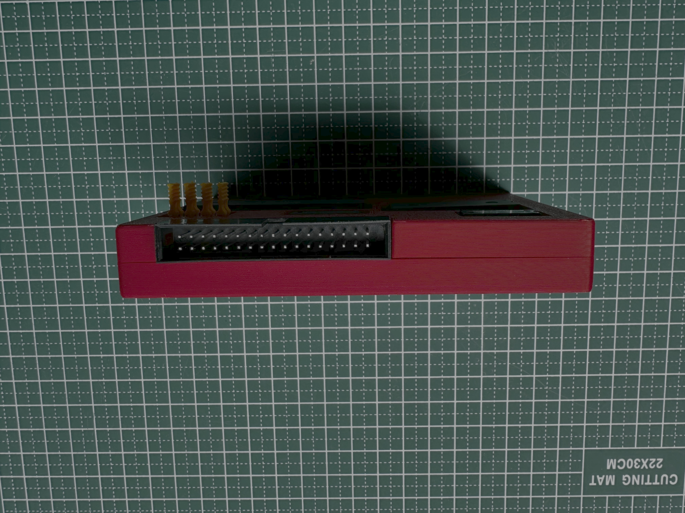

# 3D Print files

Here are some of my 3D print files projects.

## Table of Contents

- [MSXPico-Part.3mf](#msxpico-part3mf)
- [Oyanami MegaRom Cartridge](#oyanami-megarom-cartridge)
- [Skoti DC-600 Floppy drive controller](#skoti-dc-600-floppy-drive-controller)

# MSXPico-Part.3mf

A case for the MSX Pico cartridge made by Jeroen: https://github.com/jeroentaverne/msxpico?tab=readme-ov-file
I created this back of the case for Sony HB-F[5,7,9]00[B,D,F,P,S] MSX computers.
Those machines have the Cartridge slot 'upside-down' and you are looking at a plain back side without logo.
This design also makes it possible to print the MSX Pico logo with another color.
And if you have some soldering skills you could add some extra LED's which light up when Music is playing via the MSX Pico.

(this is the back part only and the logo is still upside down as my Sony MSX is mounted on the wall :D, send me a message if you need the logo mirrored)

# Oyanami MegaRom Cartridge

Mike from www.leadedsolder.com created a Cartridge where you can flash MSX Konami-mapper roms up to 128Kb.

https://www.leadedsolder.com/2024/09/03/msx-megarom-oyanami.html

I made case you can 3D print.

# Skoti DC-600 Floppy drive controller

A cartridge for the DC-600 Floppy drive controller for MSX.
https://github.com/konkotgit/MSX-DC-600

